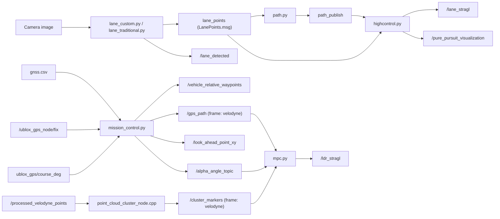

# 제4회 국제 대학생 EV 자율주행 대회 1/5부문


## 개요

담당: `lane` 패키지 전체 + `my_lane_msgs` 패키지 전체 + GPS 절대 경로와 LiDAR 상대 객체를 같은 좌표계에 align하는 로직 구현

이 README는 직접 구현한 [`lane`](./lane) 패키지 전체, [`my_lane_msgs`](./my_lane_msgs) 패키지 전체, 그리고 [`control/gps/mission_control.py`](./control/gps/mission_control.py) 내 GPS-LiDAR 좌표계 통합 로직을 설명하기 위한 문서입니다.  
`point_cloud_processor`, `mpc.py`, `selector_mpc.py`, Arduino 제어부는 프로젝트에는 포함되지만 제 담당 범위는 아니므로 여기서는 제 모듈과 맞물리는 인터페이스 중심으로만 설명합니다.

## 담당 범위

| 영역 | 패키지/모듈 | 구현한 내용 |
|---|---|---|
| Lane Perception | [`lane`](./lane) | 카메라 기반 차선 검출, BEV 변환, DBSCAN/RANSAC/Sliding Window/Kalman 기반 차선 포인트 추출, 차선 중심 경로 생성, Pure Pursuit 기반 차선 조향각 계산 |
| ROS 2 Interface | [`my_lane_msgs`](./my_lane_msgs) | 좌/우 차선 좌표 전달을 위한 `LanePoints.msg` 인터페이스 설계 및 패키지 구성 |
| Frame Integration | [`control/gps/mission_control.py`](./control/gps/mission_control.py) | GPS 절대 좌표 waypoint를 로컬 XY로 변환하고 차량 기준 상대 좌표로 재투영하여, LiDAR 클러스터 객체와 동일한 `velodyne` 기준 좌표계에서 경로를 시각화 및 활용 가능하도록 구성 |

## 시스템 목표

제가 맡은 모듈 기준으로 이 시스템은 다음 흐름을 수행하도록 설계되었습니다.

Lane
- 전방 카메라 영상에서 좌/우 차선을 추출
- 차선 점들을 기반으로 중앙 주행 경로를 생성
- 생성된 경로에서 look-ahead target을 선택해 조향각을 계산
- 차선 검출 여부를 함께 발행해 lane 주행과 GPS 주행 전환에 활용

GPS-LiDAR Frame Integration
- CSV 기반 GPS 절대 경로를 로컬 XY 좌표계로 변환
- GNSS 위치와 course heading을 이용해 waypoint를 차량 기준 상대 좌표로 변환
- 변환된 경로를 `velodyne` 프레임 기준 `/gps_path` 로 발행
- LiDAR에서 검출된 상대 좌표 장애물 마커와 같은 좌표계에서 경로를 겹쳐 표시하고 MPC 입력으로 연결

## End-To-End 파이프라인



`control/gps/my.py`는 `mission_control.py` 내부 로직을 디버깅하기 위한 코드이므로 위 파이프라인에서는 제외했습니다.

## 주요 기능

### 1. Lane 패키지 전체 구현

- 커스텀 YOLO 기반 차선 세그멘테이션 파이프라인 구현
- 전통적 영상처리 기반 차선 검출 파이프라인 구현
- Bird's Eye View 변환으로 차선 geometry를 주행 친화적 형태로 정규화
- DBSCAN, RANSAC, Kalman filter 기반으로 노이즈와 순간 검출 실패를 완화
- 좌/우 차선이 모두 있을 때는 중앙선 생성
- 한쪽 차선만 존재할 때는 offset 기반으로 가상 중심 경로 복원
- spline 기반 재샘플링으로 제어용 path 생성
- Pure Pursuit 기반 `/lane_stragl` 조향각 계산
- 디버그용 `/pure_pursuit_visualization` 이미지 발행
- 차선 검출 상태 `/lane_detected` 발행으로 lane/GPS 모드 전환 지원

### 2. 커스텀 메시지 인터페이스 구현

- `my_lane_msgs/msg/LanePoints.msg` 정의
- 좌/우 차선 포인트를 각각 `left_x`, `left_y`, `right_x`, `right_y` 배열로 전달
- 인지 노드, path 생성 노드, 제어 노드 사이를 느슨하게 연결하는 인터페이스 계층 구성

### 3. GPS 경로와 LiDAR 객체의 동일 좌표계 정렬

- GNSS waypoint CSV를 기준으로 기준점(origin) 설정
- 위도/경도를 로컬 XY로 변환해 절대 경로를 평면 좌표계로 투영
- 실시간 GNSS 위치와 heading을 사용해 waypoint를 차량 기준 상대 좌표로 변환
- 변환된 GPS 경로를 `Path` 메시지 `/gps_path` 로 발행
- `/gps_path` 의 `frame_id` 를 `velodyne` 으로 맞춰 LiDAR 클러스터 마커와 동일 좌표계에 배치
- RViz와 MPC에서 전역 경로와 상대 장애물을 동시에 다룰 수 있는 입력 형태 제공

## 패키지별 요약

### `lane`

이 패키지는 차선 인지부터 경로 생성, 조향 제어까지 lane 주행 파이프라인 전체를 맡습니다.

- 주요 파일:
  - `lane/lane/lane_custom.py`
  - `lane/lane/lane_traditional.py`
  - `lane/lane/path.py`
  - `lane/lane/highcontrol.py`
- 입력:
  - 카메라 영상 스트림
- 주요 출력:
  - `lane_points`
  - `/lane_detected`
  - `path_publish`
  - `/lane_stragl`
  - `/pure_pursuit_visualization`

### `my_lane_msgs`

이 패키지는 lane 파이프라인 전체에서 사용하는 커스텀 ROS 2 메시지 인터페이스를 정의합니다.

- 주요 파일:
  - `my_lane_msgs/msg/LanePoints.msg`
- 역할:
  - 좌/우 차선 포인트 전달
  - lane detection, path generation, control 모듈 간 데이터 형식 통일

### `control/gps/mission_control.py`

이 모듈 전체가 제 담당이라고 보기보다, 그 안에서 GPS 절대 경로를 LiDAR 기준 로컬 프레임으로 변환해 사용하는 좌표계 통합 부분을 구현 및 정리한 범위입니다.

- 주요 파일:
  - `control/gps/mission_control.py`
- 입력:
  - `gnss.csv` 또는 waypoint CSV
  - `/ublox_gps_node/fix`
  - `ublox_gps/course_deg`
- 주요 출력:
  - `/vehicle_relative_waypoints`
  - `/gps_path`
  - `/look_ahead_point_xy`
  - `/alpha_angle_topic`

## 저장소 구조

```text
.
├── control
│   └── gps
│       ├── mission_control.py
│       └── my.py
├── lane
│   ├── data
│   │   └── weights
│   │       └── best.pt
│   ├── package.xml
│   ├── setup.py
│   └── lane
│       ├── lane_custom.py
│       ├── lane_traditional.py
│       ├── path.py
│       └── highcontrol.py
└── my_lane_msgs
    ├── CMakeLists.txt
    ├── package.xml
    └── msg
        └── LanePoints.msg
```

## 기술 스택

- ROS 2 Humble
- Python
- OpenCV
- Ultralytics YOLO
- NumPy / SciPy
- ROS 2 Custom Message Interface
- GNSS local coordinate transform
- LiDAR-RViz frame visualization

## 요약

- lane 패키지 전체 구현
- `LanePoints.msg` 기반 lane 데이터 인터페이스 설계
- 차선 인지, 경로 생성, Pure Pursuit 조향 제어 파이프라인 구성
- GPS 절대 경로를 차량 기준 로컬 좌표로 변환
- GPS 경로와 LiDAR 상대 객체를 동일 `velodyne` 좌표계에 정렬
- RViz 및 MPC에서 함께 사용할 수 있는 형태로 경로 데이터 제공

## 결과 시각화

- 차선 검출 결과 이미지 또는 영상
- path 생성 및 Pure Pursuit 시각화 화면
- RViz에서 `/gps_path` 와 `/cluster_markers` 가 동일 프레임으로 겹쳐 표시되는 화면

## 결과 시각화


https://github.com/user-attachments/assets/751c6463-221e-4cab-8b5a-205b4f335e2f

